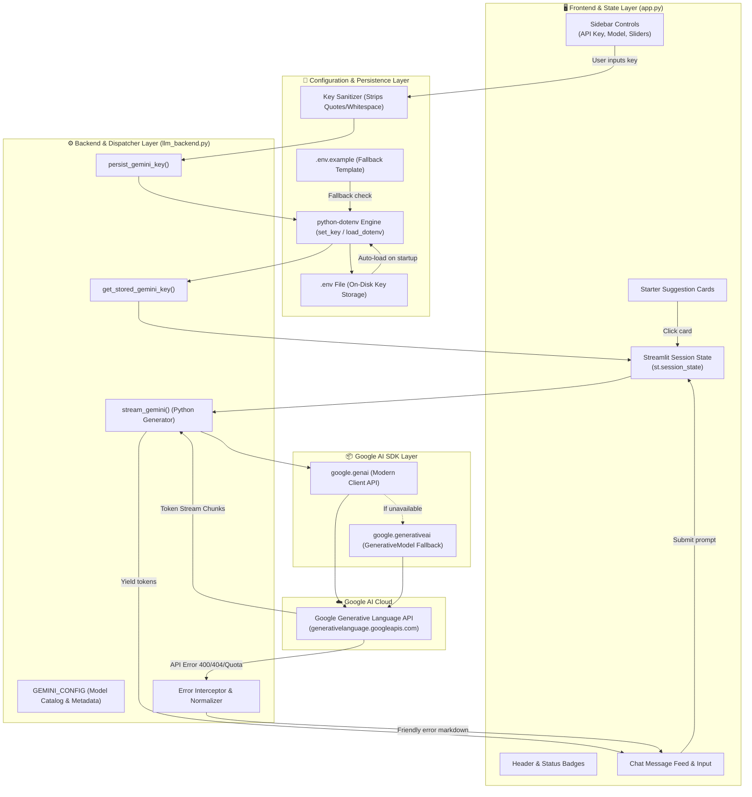
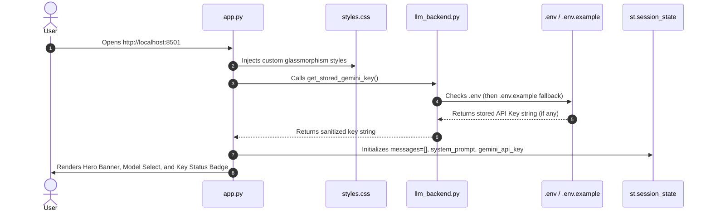
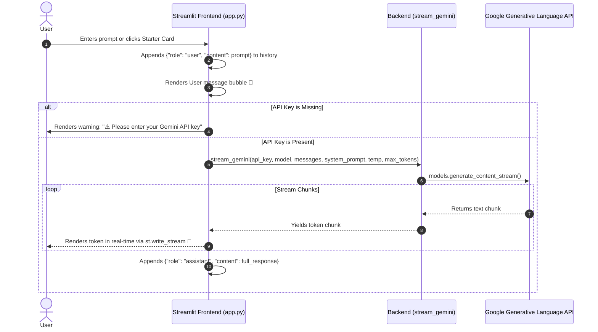

# 🌟 Gemini AI Chatbot Studio — Comprehensive Architecture & Documentation

A modern, high-performance, real-time AI Chatbot web application built with **Streamlit** and powered by **Google Gemini** models. This document provides an exhaustive, granular breakdown of every feature, component, operational lifecycle, architecture diagram, and execution flow.

---

## 📑 Table of Contents

1. [System Overview & Key Features](#-system-overview--key-features)
2. [End-to-End System Architecture](#-end-to-end-system-architecture)
3. [Execution Flowcharts & Lifecycles](#-execution-flowcharts--lifecycles)
   - [A. Application Boot & Initialization Flow](#a-application-boot--initialization-flow)
   - [B. API Key Resolution & Persistence Lifecycle](#b-api-key-resolution--persistence-lifecycle)
   - [C. Chat Interaction & Real-Time Token Streaming Loop](#c-chat-interaction--real-time-token-streaming-loop)
4. [Minute Working & Technical Component Breakdown](#-minute-working--technical-component-breakdown)
   - [`app.py` (Frontend & State Engine)](#1-apppy-frontend--state-engine)
   - [`llm_backend.py` (API Dispatcher & SDK Adapter)](#2-llm_backendpy-api-dispatcher--sdk-adapter)
   - [`styles.css` (Glassmorphic Design System)](#3-stylescss-glassmorphic-design-system)
   - [Configuration Files (`.env`, `.env.example`, `requirements.txt`)](#4-configuration-files)
5. [Step-by-Step Installation & Usage Guide](#-step-by-step-installation--usage-guide)
6. [Error Handling & Troubleshooting Reference](#-error-handling--troubleshooting-reference)

---

## 🚀 System Overview & Key Features

| Feature | Description |
| :--- | :--- |
| **🔑 Zero-Friction Key Management** | Enter your Gemini API key in the UI sidebar or `.env`. Automatic sanitization (strips quotes, spaces) and automatic disk persistence. |
| **⚡ Native Token Streaming** | Generates real-time word-by-word streaming responses using Python generators and Streamlit's `st.write_stream`. |
| **🤖 Active Gemini Model Suite** | Pre-configured with active Google Gemini models: `gemini-3.6-flash` (default), `gemini-2.5-flash`, `gemini-1.5-flash`, and `gemini-1.5-pro`. |
| **🛡️ Dual-SDK Compatibility** | Tries the latest `google-genai` (v2.x Client API) first, with seamless fallback to `google-generativeai` (v0.8.x). |
| **🎨 Glassmorphic UI Aesthetic** | Dark-mode theme with linear gradient accents, frosted glass cards, glowing borders, and Outfit / JetBrains Mono typography. |
| **🎛️ Hyperparameter Controls** | Adjust system persona/instructions, creativity temperature ($0.0 - 1.0$), and maximum token length ($256 - 4096$) in real time. |
| **💡 Quick Starter Prompts** | Interactive 1-click prompt cards for instant conversation launch. |
| **💾 Session Management** | One-click conversation reset and complete chat history export to structured JSON. |

---

## 🏛️ End-to-End System Architecture



---

## 🔄 Execution Flowcharts & Lifecycles

### A. Application Boot & Initialization Flow



---

### B. API Key Resolution & Persistence Lifecycle

```mermaid
flowchart TD
    Start([User Types Key in Sidebar]) --> ChangeEvent[Trigger on_api_key_change Callback]
    ChangeEvent --> Sanitize[Sanitize Key: strip spaces, quotes, newlines]
    Sanitize --> CheckEmpty{Is Key Empty?}
    
    CheckEmpty -- Yes --> ClearState[Set session state key to empty]
    ClearState --> BadgePending[Render 🟡 API Key Pending Badge]
    
    CheckEmpty -- No --> SaveDisk[Call persist_gemini_key()]
    SaveDisk --> WriteEnv[dotenv.set_key writes to .env on disk]
    WriteEnv --> SetOsEnv[os.environ['GEMINI_API_KEY'] updated]
    SetOsEnv --> SetSession[st.session_state.gemini_api_key updated]
    SetSession --> BadgeReady[Render 🟢 Backend Ready & Saved Badge]
    BadgeReady --> HideBanner[Hide API Key Warning Banner]
```

---

### C. Chat Interaction & Real-Time Token Streaming Loop



---

## 🔍 Minute Working & Technical Component Breakdown

### 1. `app.py` (Frontend & State Engine)

The frontend is built with Streamlit and handles reactive UI rendering, state management, and real-time streaming consumption.

#### Granular Components:
- **`load_css()`**: Reads `styles.css` and injects raw CSS into Streamlit via `st.markdown(..., unsafe_allow_html=True)`.
- **Session State Management**:
  - `st.session_state.messages`: Stores the list of conversational turns `[{"role": "user"|"assistant", "content": "..."}]`.
  - `st.session_state.gemini_api_key`: Maintains the in-memory active key.
  - `st.session_state.system_prompt`: Tracks the system persona instructions.
- **Sidebar Authentication Widget**:
  - `st.text_input` with `type="password"`, tied to an `on_change=on_api_key_change` callback.
  - Dynamically switches status badges between `● Saved & Ready` and `○ Key Required`.
  - Dedicated `💾 Save Key to .env` button for instant user feedback.
- **Model Selector**:
  - Populates models dynamically from `llm_backend.GEMINI_CONFIG["models"]`.
  - Automatically defaults to the recommended `gemini-3.6-flash`.
- **Hyperparameter Sliders**:
  - **Temperature** ($0.0 \rightarrow 1.0$ in steps of $0.05$): Controls sampling randomness.
  - **Max Output Tokens** ($256 \rightarrow 4096$ in steps of $256$): Bounds response length.
- **Conversation Controls**:
  - **Clear Chat**: Resets `st.session_state.messages = []` and executes `st.rerun()`.
  - **Export JSON**: Serializes message history to formatted JSON and serves it via `st.download_button`.
- **Streaming Pipeline**:
  - Leverages `st.write_stream(response_stream)` to consume the backend's generator chunks without blocking or page refreshes.

---

### 2. `llm_backend.py` (API Dispatcher & SDK Adapter)

The backend layer encapsulates all interactions with Google's API, environment configuration, and error normalization.

#### Granular Functions:
- **`GEMINI_CONFIG`**:
  ```python
  GEMINI_CONFIG = {
      "env_var": "GEMINI_API_KEY",
      "doc_url": "https://aistudio.google.com/app/apikey",
      "key_placeholder": "AIzaSy...",
      "default_model": "gemini-3.6-flash",
      "models": [
          "gemini-3.6-flash",
          "gemini-2.5-flash",
          "gemini-1.5-flash",
          "gemini-1.5-pro"
      ]
  }
  ```
- **`sanitize_key(key: Optional[str]) -> str`**:
  Strips surrounding whitespace, single quotes (`'`), double quotes (`"`), and trailing newlines to prevent formatting bugs.
- **`get_stored_gemini_key() -> Optional[str]`**:
  Checks in priority order:
  1. `.env` file (via `dotenv.load_dotenv(override=True)`).
  2. Process environment (`os.environ.get("GEMINI_API_KEY")`).
  3. `.env.example` fallback (auto-migrating any key found there into `.env`).
- **`persist_gemini_key(api_key: str) -> bool`**:
  Uses `dotenv.set_key(..., quote_mode="never")` to write the key cleanly to `.env` on disk and updates `os.environ["GEMINI_API_KEY"]`.
- **`stream_gemini(...) -> Generator[str, None, None]`**:
  1. Validates key presence and checks for mismatched formats (e.g. accidentally entering an OpenAI `sk-...` key).
  2. Constructs typed `types.Content` payloads with `types.Part.from_text`.
  3. Applies `types.GenerateContentConfig` with temperature, max output tokens, and `system_instruction`.
  4. Calls `client.models.generate_content_stream()` and yields chunks in real-time.
  5. Catches API errors (such as 400 Invalid Key or 404 Model Not Found) and transforms them into friendly user-facing markdown alerts.

---

### 3. `styles.css` (Glassmorphic Design System)

Provides custom styling on top of Streamlit:
- **Typography**: Imports Google Fonts **Outfit** (sans-serif) for body and headers, and **JetBrains Mono** for code blocks.
- **Color Variables**:
  - Primary Gradient: `linear-gradient(135deg, #6366f1 0%, #a855f7 50%, #ec4899 100%)`.
  - Surface Glass: `rgba(255, 255, 255, 0.05)` with `backdrop-filter: blur(12px)`.
- **Custom Components**:
  - `.hero-header`: Glowing top-border banner with gradient title.
  - `.status-badge`: Rounded pill indicators (`.badge-connected` in emerald green vs `.badge-pending` in amber yellow).
  - `.api-key-banner`: Prominent alert banner displayed only when an API key is missing.
  - `.suggestion-card`: Interactive hover-animated cards for starter prompts.

---

### 4. Configuration Files

- **[`.env`](file:///Users/macbookair/Desktop/untitled%20folder/.env)**:
  Active environment file where `GEMINI_API_KEY` is securely stored.
- **[`.env.example`](file:///Users/macbookair/Desktop/untitled%20folder/.env.example)**:
  Distribution template explaining how to obtain and configure the key.
- **[`requirements.txt`](file:///Users/macbookair/Desktop/untitled%20folder/requirements.txt)**:
  ```txt
  streamlit>=1.38.0
  google-genai>=0.1.1
  google-generativeai>=0.8.0
  python-dotenv>=1.0.1
  ```

---

## 🛠️ Step-by-Step Installation & Usage Guide

### 1. Prerequisites
- Python `3.10+` (tested on Python `3.14`).
- A free Google Gemini API key from [Google AI Studio](https://aistudio.google.com/app/apikey).

### 2. Install Dependencies
```bash
pip install -r requirements.txt
```

### 3. Configure API Key (Two Methods)

#### Method A: Inside the Web App (Easiest)
1. Launch the app (see step 4).
2. Paste your Gemini API key into the sidebar **API Key** field.
3. The app automatically saves it to `.env` on disk.

#### Method B: In `.env` File
Create or edit `.env` in the root folder:
```env
GEMINI_API_KEY=AIzaSyYourActualKeyHere
```

### 4. Launch the Streamlit App
```bash
streamlit run app.py
```
Open **[http://localhost:8501](http://localhost:8501)** in your web browser.

---

## 🚨 Error Handling & Troubleshooting Reference

| Error Code / Symptom | Root Cause | Built-in App Solution |
| :--- | :--- | :--- |
| `400 INVALID_ARGUMENT` / `API_KEY_INVALID` | API key is malformed, has accidental quotes/spaces, or is incorrect. | Key is auto-sanitized on input; clear warning is displayed directing user to [Google AI Studio](https://aistudio.google.com/app/apikey). |
| `404 NOT_FOUND` | An older or retired model checkpoint was requested (e.g. `gemini-2.0-flash`). | App defaults to `gemini-3.6-flash` and intercepts 404s advising the user to pick an active model. |
| `Key Required` Warning Banner | No API key detected in `.env` or session state. | The main chat window displays a prominent reminder card until a key is entered. |
| OpenAI key entered (`sk-...`) | User mistakenly pasted an OpenAI key instead of Gemini. | App detects `sk-` prefix and alerts user that a Gemini key starting with `AIzaSy` is required. |

---

## 📄 License & Attribution

Built with ❤️ using [Streamlit](https://streamlit.io/) and [Google Gemini](https://ai.google.dev/). Free for personal and commercial exploration.
